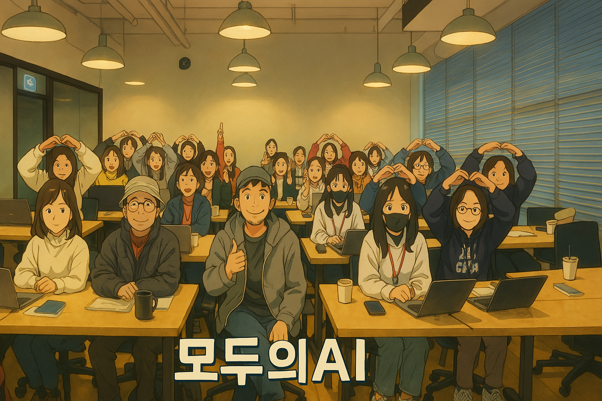

# SMART+ER PROMPT
모두의AI에서 제공하는 더 똑똑한 SMART+ER 프롬프트 템플릿
---
### 2025년 4월 4일 무료 온라인 강의 안내
아래의 내용을 읽어도 이해가 안되는 분들을 위해서 **2025년 4월 7일 오후 6시 ~ 7시30분 (90분)** 동안 속성 SMART+ER 프롬프트 마스터 온라인 무료 강의를 진행하고자 합니다. 실무에 바로 사용을 할 수 있도록 기본 SMART+ER 프롬프트 강의와 ChatGPT Project, Claude Projects에 바로 적용이 가능한 CI(Custom Instruction)를 SMART+ER 프롬프트로 작성하는 방법들을 알려드릴 예정입니다.

- 강의 일시: 2025년 4월 7일 오후 6시~7시30분 (90분)
- 강의 내용: SMART+ER 프롬프트 사용법 및 ChatGPT PROJECT CI 응용한 간단한 AI 직원 만들기
- 강의 비용: 무료 
- 강의 신청링크 : https://mo-ai.notion.site/1c89a2a0bfc280fc899dc4850f36f6ba?pvs=105

---
## 1. SMARTER 프롬프트 템플릿의 탄생 배경

> **Q: "AI에게 제대로 된 요구/지시/질문을 하기 위해서 프롬프트 엔지니어링을 배워야 하나요?"**
**A: "자동차 운전을 하기 위해서 엔진 구조를 공부하지 않습니다. 운전만 잘하는 법을 배우면 되듯이 AI에게 지시를 제대로 하기 위해서는 프롬프트 엔지니어링 보다는 AI대화의 기술만 익히면 됩니다"**

흔히 이야기 하는 생성형AI 초거대 언어 모델(LLM-Large Language Model)의 발전으로 AI의 능력이 비약적으로 향상되었지만, 이러한 능력을 100% 활용하기 위해서는 "**명확하고 구체적인 지시**"가 필요합니다. 

> **일반 사용자들이 겪는 프롬프트 작성의 어려움 → "도대체 어떻게 이야기를 해줘야 내 의도를 정확하게 이해를 할 거니?"**

모두의 AI에서 지난 1년간 진행한 **"챗GPT와 한달살기", "프롬프트의 정석", "나만의 AI직원 만들기"** 온라인/오프라인 강의를 **수강한 분들의 피드백을 분석**한 결과, 다음과 같은 주요 문제점들이 발견되었습니다:

1. **모호한 지시사항**: "좋은 아이디어 좀 줘봐"와 같은 불명확한 요청으로 인해 AI가 제대로 된 답변을 하지 못하는 경우가 많았습니다.
2. **맥락 부족**: AI에게 필요한 배경 정보나 상황 설명이 부족하여, AI가 사용자의 의도를 제대로 파악하지 못하는 경우가 있었습니다.
3. **과도한 정보**: 반대로 너무 많은 정보를 한꺼번에 제공하여 AI가 핵심을 파악하지 못하는 경우도 있었습니다.
4. **단계적 지시 부족**: 복잡한 작업을 요청할 때 단계별 지시가 없어 AI가 혼란스러워하는 경우가 있었습니다.
5. **피드백 루프 부재**: AI의 답변을 개선하기 위한 효과적인 피드백 방법을 모르는 경우가 많았습니다.

이러한 문제점들로 인해 **사용자들은 원하는 결과를 얻지 못하고, 반복적으로 프롬프트를 추가 지시하면서 3시간 80회 리밋에 도달** 하는 상황들이 반복되어지곤 했습니다.

이러한 문제를 해결하기 위해서 **SMART+ER 프롬프트 템플릿** 제작하게 되었습니다. 이 템플릿은 **일반 사용자들도 쉽게 효과적인 프롬프트를 작성할 수 있도록 돕는 구조화된 가이드라인**입니다. **SMART+ER 템플릿은 프롬프트 엔지니어링의 핵심 원칙들을 체계화**하여, 누구나 AI와 더 효과적으로 소통할 수 있도록 설계되었습니다.


---

# 2. SMART+ER 프롬프트란?

## 정의와 목적

SMART+ER 프롬프트의 주요 특징과 목적은 다음과 같습니다:

1. **사용자 친화적 구조**: 일반 사용자도 쉽게 이해하고 적용할 수 있는 체계적인 구조를 제공합니다.
2. **AI 성능 최적화**: AI 모델의 능력을 최대한 활용할 수 있도록 설계되었습니다.
3. **다양한 LLM 지원**: ChatGPT, Claude, Gemini 등 다양한 대규모 언어 모델(LLM)에 적용 가능합니다.
4. **반복 수정 최소화**: 명확한 지시와 구체적인 요구사항 제시로 **One Shot Prompting(한번에 끝내는 지시사항)** 목표로 합니다
5. **맥락 이해 향상**: AI가 사용자의 의도와 상황을 정확히 파악할 수 있도록 돕습니다.

## SMART+ER 약어 풀이

SMARTER는 템플릿의 핵심 구성 요소를 나타내는 약어입니다:

**필수 요소 5가지**

- **S**: Situation (상황) - 현재 **상황**이나 **배경**을 설명합니다.
- **M**: Mission (목표) - 달성하고자 하는 **목표**를 명시합니다.
- **A**: Action Steps (단계별 수행) - AI가 **수행해야 할 단계**를 나열합니다.
- **R**: Result (결과) - 원하는 **결과물의 형식**을 지정합니다.
- **T**: Tone&Style (톤과 스타일) - 생셩결과에 대한 **특별한 요구사항**이나 **스타일을 지정**합니다.

**추가 요소 2가지**

- **E**: Example (예시) - **AI의 이해를 돕기 위한 예시**를 제공합니다.
- **R**: Resource (자료) - AI가 생성 작업에 필요한 첨부된 지식 데이터의 **추가** **정보나 자료**를 **상세 설명**합니다.

이 템플릿은 프롬프트 작성을 체계화하여, 사용자가 자신의 요구사항을 명확하게 전달하고 AI로부터 원하는 결과를 얻을 수 있도록 도와줍니다.

---

# 3. SMART+ER 템플릿의 구성 요소

## S: Situation (상황)

- **목적**: AI에게 현재 상황이나 배경을 제공합니다.
- **작성 방법**: AI는 여러분의 상황을 전혀 알지 못합니다, 따라서 간결하면서도 충분한 맥락을 제공하세요.
- **예시**:
    
    ```markdown
    ## S(상황)
    우리 회사는 환경 친화적인 제품 라인을 출시하려고 합니다. 현재 플라스틱 사용량을 줄이는 것이 주요 과제입니다.
    ```
    

## M: Mission (목표)

- **목적**: 여러분이 이 프롬프트를 통해서 달성하고자 하는 구체적인 목표를 명시합니다.
- **작성 방법**: 명확하고 측정 가능한 목표를 설정하세요. (기간, 수치, 범위, 국가, 대상등 명확하게 설명)
- **예시**:
    
    ```markdown
    ## M(목표)
    6개월 내에 제품 포장의 플라스틱 사용량을 50% 줄이는 전략을 수립하고자 합니다.
    ```
    

## A: Action Steps (단계별 수행)

- **목적**: AI가 수행해야 할 구체적인 단계를 나열합니다.
- **작성 방법**:
    - 순서대로 명확한 지시사항을 제공하세요.
    - 필요에 따라 **“중요: 각 단계가 완료가 되면 사용자에게 결과를 확인을 받고 다음단계 진행 여부 확인해야 합니다.”** -> 이 내용을 추가하면 내용이 풍부하게 생성(Max Output Token 최대 사용)이되고 각 단계별 결과물이 생성이 되었을 때 각 단계 내용만 수정 요청하면 대화창에 생성되는 텍스트를 절약이 되면서 Context window Token 낭비를 줄일 수가 있습니다. 
- **예시**:
    
    ```markdown
    ## A(단계별 수행)
    "중요: 각 단계가 완료가 되면 사용자에게 결과를 확인을 받고 다음단계 진행 여부 확인해야 합니다"
    1. 현재 제품 포장의 플라스틱 사용량을 분석하세요.
    2. 플라스틱 대체 가능한 친환경 소재 3가지를 제안하세요.
    3. 각 대체 소재의 장단점을 비교 분석하세요.
    4. 선택한 소재로 전환 시 예상되는 비용과 시간을 계산하세요.
    5. 6개월간의 단계별 전환 계획을 수립하세요.
    ```
    

## R: Result (결과)

- **목적**: 원하는 결과물의 형식과 내용을 지정합니다.
- **작성 방법**: 구체적인 형식, 길이, 포함해야 할 요소 등을 명시하세요.
- **예시**:
    
    ```markdown
    ## R(결과물)
    다음 요소를 포함한 5페이지 분량의 보고서를 작성해주세요:
    - 현황 분석
    - 대체 소재 비교표
    - 비용 및 시간 추정치
    - 6개월 전환 계획 타임라인
    - 예상되는 환경적 영향
    ```
    

## T: Tone & Style (톤과 스타일)

- **목적**: 특별한 요구사항이나 선호하는 스타일을 지정합니다.
- **작성 방법**: 톤, 형식, 특정 제약사항 등을 명시하세요.
- **예시**:
    
    ```markdown
    ## T(톤과스타일)
    - 보고서는 경영진이 이해하기 쉬운 비전문적 용어를 사용해주세요.
    - 각 섹션에 요약 bullet point를 포함해주세요.
    - 환경 관련 통계는 신뢰할 수 있는 출처를 인용해주세요.
    ```
    

## E: Example (예시)

- **목적**: 참고할 만한 예시나 템플릿을 제공합니다.
- **작성 방법**: 유사한 프로젝트나 원하는 결과물의 예시를 제시하세요.
- **예시**:
    
    ```markdown
    ## E(예시참조)
    다음 링크의 보고서 형식을 참고해주세요: 
    - [환경 영향 평가 보고서 예시]
    - "내가 작성한 문체로 동일하게 작성해주세요"
    ```

## R: Resource (자료)

- **목적**: 작업에 필요한 추가 정보나 자료를 제공합니다.
- **작성 방법**: 관련 데이터, 링크, 참고 문서 등을 제시하세요.
- **예시**:
    
    ```markdown
    ## R(자료참고)
    - 현재 제품 포장 명세서: [링크]
    - 친환경 포장 소재 시장 조사 보고서: [첨부 파일]
    - 회사 환경 정책 문서: [링크]
    ```
    

---

# 4. 각 구성 요소 상세 설명 및 작성 방법

## S: Situation (상황)

### 상세 설명

Situation은 AI에게 현재 상황이나 배경을 제공하는 부분입니다. 이는 AI가 사용자의 전체적인 맥락을 이해하고 적절한 답변을 생성하도록 합니다.

### 작성 방법

- 간결하면서도 필수적인 정보를 모두 포함하세요.
- 5W1H (Who, What, When, Where, Why, How) 질문을 고려하여 작성하세요.
- 업계 특정 용어나 새로운 용어의 배경 지식이 필요한 경우 간단히 설명해주세요. 예: MCP(Model Context Protocol)

### 주의사항

- 너무 많은 정보로 AI를 혼란스럽게 하지 마세요.
- 불필요한 개인 정보는 포함하지 마세요.

### 예시

```markdown
## SITUATION
- 우리 회사는 중소기업 패션 브랜드 OOO입니다. 최근 Z세대 고객층의 이탈이 심해지고 있어 우려됩니다.
- 지난 2024년 3/4분기 대비 2025년 1월 Z세대 고객의 구매율이 85%에서 -30% 감소했으며,
소셜미디어 참여도도 60%에서 -20% 하락했습니다. 
- 2025년 마케팅 예산은 연간 5억 원이며, 디지털 마케팅 전문가가 부족한 상황입니다.
```

## M: Mission (목표)

### 상세 설명

Mission은 달성하고자 하는 구체적인 목표를 명시하는 부분입니다. 이는 AI가 제안하는 솔루션의 방향을 결정하는 데 중요합니다.

### 작성 방법

- 가능한 한 수치화된 목표를 제시하세요.
- 단기 목표와 장기 목표를 구분하여 제시할 수 있습니다.

### 주의사항

- 너무 광범위하거나 모호한 목표는 피하세요.
- 현실적으로 달성 가능한 목표를 설정하세요.

### 예시

```markdown
## MISSION
- 향후 6개월 내에 Z세대 고객의 구매율을 현재 수준에서 20% 증가시킵니다.
- 3개월 내에 소셜미디어 참여도를 50% 향상시킵니다.
- 연간 마케팅 예산을 10% 이상 절감하면서 위 목표를 달성합니다.
```

## A: Action Steps (단계별 수행)

### 상세 설명

Action Steps는 AI가 수행해야 할 구체적인 단계를 나열하는 부분입니다. 이는 AI가 체계적으로 작업을 수행하도록 안내합니다.

### 작성 방법

- 순서대로 명확한 지시사항을 제공하세요.
- 각 단계는 구체적이고 실행 가능해야 합니다.
- 필요한 경우 하위 단계로 세분화할 수 있습니다.
- 필요에 따라 **“중요: 각 단계가 완료가 되면 사용자에게 결과를 확인을 받고 다음단계 진행 여부 확인해야 합니다”**

### 주의사항

- 너무 많은 단계를 한 번에 제시하지 마세요. 필요하다면 여러 단계로 나누어 요청하세요.
- 각 단계 사이의 논리적 연결성을 확인하세요.

### 예시

```markdown
## ACTION STEPS
“중요: 각 단계가 완료가 되면 사용자에게 결과를 확인을 받고 다음단계 진행 여부 확인해야 합니다.”
1. 첨부한 자료(Deep Research자료)를 토대로 Z세대의 최신 패션 트렌드와 소비 행동을 분석하세요.
2. 우리 브랜드의 현재 마케팅 전략과 Z세대 트렌드 간의 격차를 파악하세요.
3. Z세대 타겟 디지털 마케팅 전략을 3가지 제안하세요. 각 전략은 다음을 포함해야 합니다:
   a. 주요 소셜미디어 플랫폼 활용 방안
   b. 인플루언서 마케팅 전략
   c. 예상 비용과 ROI
4. 제안된 전략 중 가장 비용 효율적인 방안을 선정하고, 그 이유를 설명하세요.
5. 선정된 전략의 2025년 하반기 실행 계획을 수립하세요.
```

## R: Result (결과)

### 상세 설명

Result는 AI에게 원하는 결과물의 형식과 내용을 명확히 지정하는 부분입니다. 이를 통해 기대하는 출력의 구조와 세부 사항을 명확히 할 수 있습니다.

### 작성 방법

- 원하는 결과물의 형식(예: 보고서, 목록, 스크립트 등)을 명시하세요.
- 결과물에 포함되어야 할 주요 요소나 섹션을 나열하세요.
- 가능한 경우, 원하는 길이나 세부 수준을 지정하세요.

### 주의사항

- 너무 엄격하게 규정하여 AI의 창의성을 제한하지 않도록 주의하세요.
- 결과물의 용도나 대상 독자를 고려하여 적절한 형식을 선택하세요.

### 예시

```markdown
## RESULT
다음 요소를 포함한 5페이지 분량의 마케팅 전략 보고서를 작성해주세요:
1. 현재 시장 상황 요약 (1페이지, 3문단, 각문단 500자 이상)
2. 타겟 고객 분석 (1페이지, 3문단, 각문단 500자 이상)
3. 3가지 주요 마케팅 전략 제안 (각 전략당 0.5페이지, 2문단, 각문단 200자 이상)
4. 예상 비용 및 ROI 분석 (1페이지, 3문단, 각문단 500자 이상)
5. 6개월 실행 계획 타임라인 (0.5페이지, 2문단, 각문단 300자 이상)
6. 요약 및 결론 (0.5페이지, 3문단, 각문단 100자 이상)
```

## T: TONE & STYLE (톤앤 스타일)

### 상세 설명

TONE & STYLE은 결과물을 특정 요구사항이나 선호에 맞게 조정하도록 AI에게 지시하는 부분입니다. 이를 통해 더욱 맞춤화된 결과를 얻을 수 있습니다.

### 작성 방법

- 특정 스타일, 톤, 또는 형식에 대한 선호를 명시하세요.
- 포함하거나 제외해야 할 특정 요소나 주제를 언급하세요.
- 대상 독자나 사용 맥락을 고려한 맞춤화 요청을 하세요.

### 주의사항

- 너무 많은 제약을 두어 AI의 성능을 제한하지 않도록 주의하세요.
- 맞춤화 요청이 다른 섹션의 지시사항과 모순되지 않도록 하세요.

### 예시

```markdown
## TONE & STYLE
- 보고서는 비전문가도 이해할 수 있는 쉬운 언어로 작성해주세요.
- 각 섹션의 시작 부분에 핵심 요약을 bullet point로 제공해주세요.
- 가능한 경우 실제 사례나 통계를 활용하여 논점을 뒷받침해주세요.
- 전체적으로 긍정적이고 솔루션 중심적인 톤을 유지해주세요.
- 회사의 브랜드 컬러인 파란색(#0000FF)을 강조색으로 사용해주세요.
```

## E: Example (예시) / R: Resource (자료)

### 상세 설명

Example과 Resource는 AI에게 참고할 만한 예시나 추가 자료를 제공하는 선택적 섹션입니다. 이들 섹션은 AI가 더 정확하고 관련성 높은 결과를 생성하는 데 도움을 줄 수 있습니다.

### 중요 안내

**E(Example)와 R(Resource)은 필수 섹션이 아닙니다.** 이들은 필요한 경우에만 사용하며, 상황에 따라 생략할 수 있습니다. 특히 다음과 같은 경우에 이 섹션들을 생략할 수 있습니다:

- 간단하거나 일반적인 요청의 경우
- 특정 예시나 추가 자료가 필요하지 않은 경우
- 이미 충분한 정보가 다른 섹션에서 제공된 경우

### 작성 방법 (사용 시)

- Example: 원하는 결과물과 유사한 예시나 참고할 만한 형식을 제공하세요.
- Resource: 관련 데이터, 문서, 링크 등 추가 정보 출처를 제공하세요.

### 예시

```markdown
## EXAMPLE
- 첨부된 "성공적인_마케팅_캠페인.pdf" 문서의 구조와 분석 방식을 참고해주세요.
- 보도자료 내용은 첨부한 링크의 스타일을 참고하세요

## RESOURCE
- 최신 시장 조사 데이터: [링크]
- 회사 브랜드 가이드라인: [첨부 파일]
- 경쟁사 분석 보고서: [문서 링크]
```

---

# 5. SMARTER 템플릿 예제
## 예제 사용방법
[내용] '내용'은 여러분둘의 상황에 맞게 수정해서 사용하시면 됩니다. 

---

## 사무국 기획 및 사업총괄 - 프로젝트 관리

사무국 기획 및 사업총괄을 위한 프로젝트 관리 프롬프트

### 프롬프트 작성 팁

- 상황: 사무국 기획 및 사업총괄의 현재 프로젝트 상황을 구체적으로 설명합니다.
- 목표: 프로젝트 관리의 구체적인 목표를 설정합니다.
- 실행 계획: 프로젝트를 효과적으로 관리하기 위한 단계별 계획을 제시합니다.
- 결과물: 원하는 프로젝트 관리 계획서나 일정표 등의 형태를 명확히 합니다.
- 톤과 스타일: 전문적이고 체계적인 어조를 사용합니다.

### 프롬프트 예시

```markdown
## S: 상황
- [당신]은 [사무국 기획 및 사업총괄]으로, 현재 [신규 사업 런칭 프로젝트]를 진행 중입니다.
- 프로젝트는 [6개월 내에 완성]되어야 하며, [예산 1억 원]으로 설정되어 있습니다.
- 팀은 [기획, 마케팅, 개발, 디자인] 등 다양한 부서로 구성되어 있으며, 현재 [초기 기획 단계]에 있습니다.
- 이전 프로젝트에서는 [일정 지연 및 예산 초과] 문제가 발생했으므로, 이번에는 이를 개선하고자 합니다.

## M: 목표
- [6개월 내에 신규 사업 런칭]을 성공적으로 완료하는 것이 목표입니다.
- [프로젝트 일정 준수] 및 [예산 내 운영]을 통해 프로젝트의 효율성을 극대화합니다.
- 팀 간의 원활한 협업과 커뮤니케이션을 강화하여 [프로젝트의 품질을 높이는 것]을 목표로 합니다.

## A: 실행 계획
- 중요 사항: 각 단계마다 생성된 결과물에 대해 사용자가 추가/수정 사항을 확인한 후, 다음 단계로 진행합니다

1. 프로젝트 일정 수립
   - 전체 프로젝트를 단계별로 나누고, 각 단계의 마일스톤을 설정합니다.
   - Gantt 차트를 활용하여 시각적으로 일정을 관리합니다.

2. 예산 관리
   - 예산 항목을 세분화하고, 각 항목별 예산을 배정합니다.
   - 정기적인 예산 검토를 통해 초과 지출을 방지합니다.

3. 팀 구성 및 역할 분담
   - 각 부서의 역할과 책임을 명확히 정의합니다.
   - 정기적인 팀 회의를 통해 진행 상황을 공유하고, 문제점을 해결합니다.

4. 리스크 관리
   - 프로젝트 진행 중 발생할 수 있는 리스크를 식별하고, 대응 계획을 수립합니다.
   - 리스크 발생 시 즉각적인 대응을 통해 프로젝트 지연을 최소화합니다.

## R: 결과물
- [프로젝트 관리 계획서]를 작성하며, 다음의 항목을 포함합니다:
  - 프로젝트 개요
  - 일정 및 마일스톤
  - 예산 내역
  - 팀 구성 및 역할
  - 리스크 관리 계획

## T: 톤과 스타일
- 어조: 전문적이고 체계적인 어조
- 스타일: 간결하고 명확한 문장, 표와 목록을 활용하여 정보의 가독성 높임
- 대상 독자: 프로젝트 팀원 및 경영진
```

---

## 총괄 경영 대표이사 - 법률 자문 및 계약 검토

총괄 경영 대표이사를 위한 법률 자문 및 계약 검토 프롬프트

### 프롬프트 작성 팁

- 상황: 대표이사의 현재 법률적 이슈나 계약 상황을 상세히 설명합니다.
- 목표: 법률 자문 및 계약 검토의 구체적인 목표를 설정합니다.
- 실행 계획: 법률 검토를 위한 단계별 접근 방식을 제시합니다.
- 결과물: 법률 자문 보고서나 계약서 수정안 등의 형태를 명확히 합니다.
- 톤과 스타일: 전문적이고 신뢰성 있는 어조를 사용합니다.

### 프롬프트 예시

```markdown
## S: 상황
- [당신]은 [총괄 경영 대표이사]로, 현재 [신규 파트너십 계약]을 검토하고 있습니다.
- 계약 내용은 [공동 마케팅, 기술 협력, 수익 배분] 등 다양한 조항을 포함하고 있으며, [법률 자문]이 필요합니다.
- 이전 계약에서 [법적 분쟁]이 발생한 경험이 있어, 이번에는 더욱 신중하게 검토하고자 합니다.
- 현재 [법무팀]과 외부 법률 자문가와 협력하여 계약을 검토 중입니다.

## M: 목표
- [신규 파트너십 계약]이 법적으로 문제가 없으며, 회사의 이익을 최대화할 수 있도록 검토합니다.
- [법적 리스크]를 최소화하고, 계약의 명확성을 높이는 것이 목표입니다.
- [검토 완료 및 승인]을 [2주 내로] 완료합니다.

## A: 실행 계획
- 중요 사항: 각 단계마다 생성된 결과물에 대해 사용자가 추가/수정 사항을 확인한 후, 다음 단계로 진행합니다

1. 계약서 초안 검토
   - 주요 조항을 중심으로 계약서 초안을 검토합니다.
   - 법률 용어의 정확성을 확인하고, 모호한 부분을 수정합니다.

2. 리스크 분석
   - 계약서에 포함된 리스크 요소를 식별하고, 이에 대한 대응 방안을 마련합니다.
   - 잠재적인 법적 분쟁 가능성을 평가합니다.

3. 수정 및 협상
   - 필요한 수정 사항을 반영하여 계약서를 수정합니다.
   - 파트너사와 협상을 진행하여 상호 이익을 도모합니다.

4. 최종 검토 및 승인
   - 수정된 계약서를 최종 검토하고, 법무팀 및 경영진의 승인을 받습니다.
   - 모든 수정 사항이 반영되었는지 확인합니다.

## R: 결과물
- [법률 자문 보고서]를 작성하며, 다음의 항목을 포함합니다:
  - 계약서 주요 조항 분석
  - 법적 리스크 평가
  - 수정 및 협상 제안 사항
- [수정된 계약서]를 제공하며, 모든 수정 사항이 명확히 반영되어 있습니다.
- [최종 승인 문서]를 작성하여 계약의 최종 승인 상태를 기록합니다.

## T: 톤과 스타일
- 어조: 전문적이고 신뢰성 있는 어조
- 스타일: 정중하고 공식적인 문체, 법률 용어의 정확한 사용
- 대상 독자: 경영진, 법무팀, 외부 법률 자문가
```

---

## 기획 - 시니어 유저에게 유의미한 콘텐츠 생성

기획자를 위한 시니어 유저 대상 콘텐츠 생성 프롬프트

### 프롬프트 작성 팁

- 상황: 시니어 유저의 현재 콘텐츠 요구사항과 배경을 설명합니다.
- 목표: 시니어 유저에게 유의미한 콘텐츠를 생성하는 구체적인 목표를 설정합니다.
- 실행 계획: 콘텐츠 생성의 단계별 계획을 제시합니다.
- 결과물: 원하는 콘텐츠의 형태나 형식을 명확히 합니다.
- 톤과 스타일: 시니어 유저에 맞는 친절하고 이해하기 쉬운 어조를 사용합니다.

### 프롬프트 예시

```markdown
## S: 상황
- [당신]은 [기획자]로, 현재 [시니어 유저를 위한 디지털 교육 프로그램]을 기획 중입니다.
- 시니어 유저들은 [디지털 기기 사용에 대한 낮은 자신감]과 [기술적 장벽]을 경험하고 있습니다.
- 기존의 콘텐츠는 주로 [기초적인 사용법]에 초점을 맞추었으나, 시니어 유저의 [심화된 학습 욕구]를 충족시키지 못하고 있습니다.
- 이번 프로젝트는 시니어 유저의 요구에 맞춘 [유의미하고 실용적인 콘텐츠]를 제공하고자 합니다.

## M: 목표
- [6개월 내에 디지털 교육 프로그램을 완료]하고, [시니어 유저의 디지털 기기 활용 능력 향상]을 목표로 합니다.
- [참여자 만족도 90% 이상]을 달성하며, [프로그램 완료 후의 실용성 평가]를 통해 성공을 측정합니다.
- [콘텐츠의 접근성과 이해도]를 높여 시니어 유저의 학습 효과를 극대화합니다.

## A: 실행 계획
- 중요 사항: 각 단계마다 생성된 결과물에 대해 사용자가 추가/수정 사항을 확인한 후, 다음 단계로 진행합니다

1. 시니어 유저 요구 분석
   - 설문조사 및 인터뷰를 통해 시니어 유저의 필요와 기대를 파악합니다.
   - 기존 프로그램의 피드백을 분석하여 개선점을 도출합니다.

2. 콘텐츠 기획
   - [기초 사용법] 외에 [고급 기능 활용], [안전한 인터넷 사용법], [온라인 소통 방법] 등 다양한 주제를 포함합니다.
   - 각 주제에 맞는 학습 자료와 실습 과제를 설계합니다.

3. 콘텐츠 제작
   - 이해하기 쉬운 언어와 시각적 자료를 활용하여 콘텐츠를 제작합니다.
   - 동영상 강의, PDF 자료, 실습 가이드 등 다양한 형식으로 제공합니다.

4. 테스트 및 피드백
   - 파일럿 프로그램을 운영하여 시니어 유저의 피드백을 수집합니다.
   - 피드백을 바탕으로 콘텐츠를 수정 및 보완합니다.

## R: 결과물
- [디지털 교육 프로그램 커리큘럼]을 작성하며, 다음의 항목을 포함합니다:
  - 각 주차별 학습 목표 및 내용
  - 강의 자료 및 실습 과제
  - 평가 및 피드백 방법
- [동영상 강의 시리즈]를 제작하여, 시니어 유저가 따라하기 쉬운 형식으로 제공합니다.
- [참여자 만족도 설문지]를 통해 프로그램의 효과를 평가할 수 있는 도구를 마련합니다.

## T: 톤과 스타일
- 어조: 친절하고 이해하기 쉬운 어조
- 스타일: 명확하고 간결한 문체, 시각적 자료와 예시를 풍부하게 활용
- 대상 독자: 시니어 유저, 교육 프로그램 기획자

```

---

## 디자이너 - 디자인 및 영상 제작

디자이너를 위한 디자인 및 영상 제작 프롬프트

### 프롬프트 작성 팁

- 상황: 현재 디자인 또는 영상 제작의 배경과 목적을 설명합니다.
- 목표: 디자인 또는 영상 제작의 구체적인 목표를 설정합니다.
- 실행 계획: 디자인 또는 영상 제작을 위한 단계별 계획을 제시합니다.
- 결과물: 원하는 디자인 또는 영상의 형태나 형식을 명확히 합니다.
- 톤과 스타일: 창의적이고 시각적으로 매력적인 어조를 사용합니다.

### 프롬프트 예시

```markdown
## S: 상황
- [당신]은 [디자이너]로, 현재 [신제품 런칭 캠페인]을 위한 디자인 및 영상 제작을 담당하고 있습니다.
- 신제품은 [혁신적인 스마트 기기]로, 이를 효과적으로 홍보하기 위한 시각적 자료가 필요합니다.
- 마케팅 팀과 협력하여 [일관된 브랜드 이미지]를 유지하면서 창의적인 콘텐츠를 제작하고자 합니다.
- 이전 캠페인에서 사용된 디자인은 [고객의 관심을 충분히 끌지 못함]이라는 피드백을 받았습니다.

## M: 목표
- [신제품 런칭을 위한 3개의 주요 디자인 자료]와 [1개의 홍보 영상]을 제작합니다.
- 디자인 자료는 [브랜드 가이드라인에 맞추면서도 창의적인 요소]를 포함하도록 합니다.
- 영상은 [2분 이내]로 제작하여, [소셜 미디어 및 웹사이트에 게시]할 예정입니다.
- [런칭 캠페인 기간 내에 모든 자료를 완성]하는 것이 목표입니다.

## A: 실행 계획
- 중요 사항: 각 단계마다 생성된 결과물에 대해 사용자가 추가/수정 사항을 확인한 후, 다음 단계로 진행합니다

1. 콘셉트 개발
   - 신제품의 핵심 가치를 반영한 디자인 및 영상 컨셉을 개발합니다.
   - 스토리보드를 작성하여 영상의 흐름을 계획합니다.

2. 디자인 제작 기획
   - [제품 이미지, 배너, 포스터] 등의 디자인 요소를 기획합니다.
   - 브랜드 색상, 로고, 타이포그래피 등을 일관되게 적용합니다.

3. 영상 제작 기획
   - 촬영 및 편집을 통해 홍보 영상을 콘티 기획합니다.
   - 음악, 자막, 그래픽 효과 등을 활용하여 영상의 완성도를 높이기 위해 제안하세요

4. 협업 제안서 작성
   - 마케팅 팀과 협력하여 디자인 및 영상 자료를 검토하도록 5page분량의 제안서를 작성하세요

## R: 결과물
- [3개의 디자인 기획서]:
  - 제품 포스터 (A3 사이즈)
  - 소셜 미디어 배너 (1080x1080 픽셀)
  - 웹사이트 배너 (1920x1080 픽셀)
- [1개의 홍보 영상 기획서]:
  - 길이: [2분 이내]
  - 해상도: [1080p]
  - 형식: [MP4]
- [디자인 및 영상 협업 제안서]:
  - 협업 요청 제안

## T: 톤과 스타일
- 어조: 창의적이고 열정적인 어조
- 스타일: 시각적으로 매력적인 요소를 강조, 동적인 디자인과 영상 편집
- 대상 독자: 마케팅 팀, 잠재 고객, 내부 임직원

```

---

## 영상제작 및 행정 - 영상 제작

영상제작 및 행정을 위한 영상 제작 프롬프트

### 프롬프트 작성 팁

- 상황: 현재 영상 제작의 배경과 목적을 설명합니다.
- 목표: 영상 제작의 구체적인 목표를 설정합니다.
- 실행 계획: 영상 제작을 위한 단계별 계획을 제시합니다.
- 결과물: 원하는 영상의 형태나 형식을 명확히 합니다.
- 톤과 스타일: 시청자에게 전달하고자 하는 메시지에 맞는 어조와 스타일을 사용합니다.

### 프롬프트 예시

```markdown
## S: 상황
- [당신]은 [영상제작 및 행정 담당자]로, 현재 [사내 교육용 영상 시리즈]를 제작하고 있습니다.
- 교육 대상은 [신입사원]으로, 회사의 문화와 업무 프로세스를 이해시키는 것이 목적입니다.
- 기존의 교육 자료는 [텍스트 중심]으로, 이해도가 낮고 흥미를 유발하지 못한다는 피드백을 받았습니다.
- 이번 프로젝트는 [시각적이고 흥미로운 영상]을 통해 교육 효과를 높이고자 합니다.

## M: 목표
- [3개의 교육용 영상]을 제작하여 [내부 교육 프로그램]에 활용합니다.
- 각 영상의 길이는 [10분 이내]로 하며, [시청자의 이해도와 흥미 유발]을 목표로 합니다.
- [다음 분기까지 모든 영상 제작 완료]를 목표로 합니다.

## A: 실행 계획
- 중요 사항: 각 단계마다 생성된 결과물에 대해 사용자가 추가/수정 사항을 확인한 후, 다음 단계로 진행합니다

1. 콘텐츠 기획
   - 교육 내용과 주요 메시지를 정의합니다.
   - 각 영상의 스토리보드를 작성하여 전체 흐름을 계획합니다.

2. 대본 작성
   - 교육 내용을 쉽게 이해할 수 있도록 대본을 작성합니다.
   - 시각적 요소와 연계된 설명을 포함시킵니다.

3. 촬영 준비
   - 필요한 장비와 장소를 준비를 제안하세요
   - 출연자 및 촬영 일정을 제안하세요

4. 영상 촬영
   - 촬영을 위한 스토리 보드를 작성하세요
   - 조명, 음향 등 촬영 품질을 위한 체크리스트를 작성하세요

## R: 결과물
- [3개의 교육용 영상 기획안]:
  - 주제별로 나누어진 영상 (예: 회사 문화, 업무 프로세스, 팀 협업)
  - 해상도: [1080p]
  - 형식: [MP4]
- [스토리보드 및 대본]:
  - 각 영상의 스토리보드와 대본

## T: 톤과 스타일
- 어조: 친근하고 교육적인 어조
- 스타일: 시각적 요소를 강조한 동적 스타일, 명확한 설명과 예시 사용
- 대상 독자: 신입사원, 교육 담당자
```

---

## 프로그램 운영 보조 - 고객 서비스 및 문의 응대

프로그램 운영 보조를 위한 고객 서비스 및 문의 응대 프롬프트

### 프롬프트 작성 팁

- 상황: 고객 서비스 상황과 현재 문의 유형을 설명합니다.
- 목표: 효과적인 고객 서비스 및 문의 응대의 구체적인 목표를 설정합니다.
- 실행 계획: 고객 응대를 위한 단계별 계획을 제시합니다.
- 결과물: 원하는 응대 방식이나 자료의 형태를 명확히 합니다.
- 톤과 스타일: 친절하고 신속한 어조를 사용합니다.

### 프롬프트 예시

```markdown
## S: 상황
- [당신]은 [교육 프로그램 운영 보조]로, 현재 [온라인 교육 플랫폼]에서 고객의 문의를 받고 있습니다.
- 주로 [회원 가입, 결제 문제, 강의 접근성] 관련 문의가 많습니다.
- 최근 사용자 증가로 인해 문의량이 급격히 증가하였으며, 신속하고 정확한 응대가 필요합니다.
- 기존의 FAQ는 일부 문의에 대한 충분한 답변을 제공하지 못하고 있습니다.

## M: 목표
- [고객 문의에 대한 응답 시간을 평균 24시간 이내]로 단축합니다.
- [문의 해결률 95% 이상]을 달성하여 고객 만족도를 높입니다.
- [FAQ]를 업데이트하여 [반복적인 문의 감소]를 목표로 합니다.

## A: 실행 계획
- 중요 사항: 각 단계마다 생성된 결과물에 대해 사용자가 추가/수정 사항을 확인한 후, 다음 단계로 진행합니다

1. 문의 유형 분석
   - 최근 3개월간의 고객 문의 데이터를 분석하여 주요 문의 유형을 파악합니다.
   - 빈번한 문의 사항을 중심으로 FAQ를 재구성합니다.

2. 응대 매뉴얼 작성
   - 각 문의 유형별로 표준 응대 절차를 작성합니다.
   - 응답 템플릿을 마련하여 일관된 응대를 유지합니다.

3. 자동화 도구 도입
   - 챗봇을 활용하여 기본적인 문의에 대한 자동 시나리오 응답을 설계하세요
   - AI 기반의 고객 지원 도구를 도입하여 효율성을 높이기 위한 제안을 해주세요

4. 팀 교육
   - 고객 응대 담당자들에게 새로운 매뉴얼과 도구 사용법을 교육하기 위한 자료를 작성하세요
   - 정기적인 교육을 통해 응대 품질을 유지할 수 있도록 설계하세요.

## R: 결과물
- [업데이트된 FAQ]:
  - 주요 문의 유형에 대한 상세한 답변 포함
  - 검색 기능 강화하여 사용자가 쉽게 찾을 수 있도록 함
- [응대 매뉴얼]:
  - 문의 유형별 응대 절차와 템플릿 포함
  - 매뉴얼을 노션 페이지 형식으로 배포를 위한 마크다운 형식
- [챗봇 응답 스크립트]:
  - 자주 묻는 질문에 대한 자동 응답 스크립트 작성

## T: 톤과 스타일
- 어조: 친절하고 신속한 어조
- 스타일: 명확하고 간결한 문장, 고객 중심의 응대 방식
- 대상 독자: 고객, 고객 지원 팀원
```
